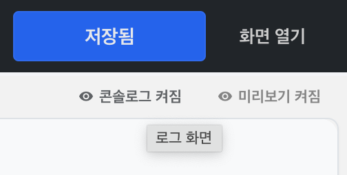
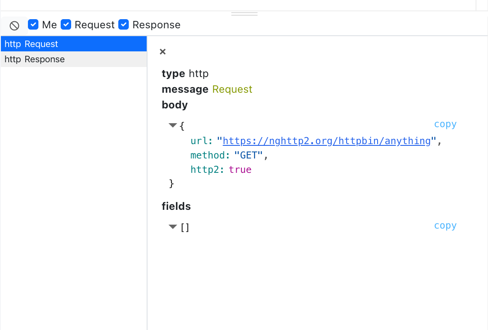
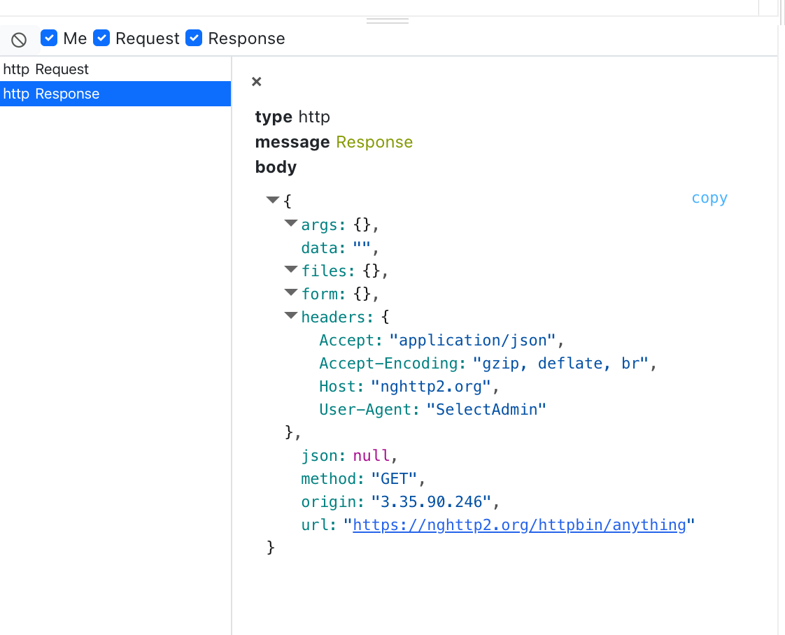
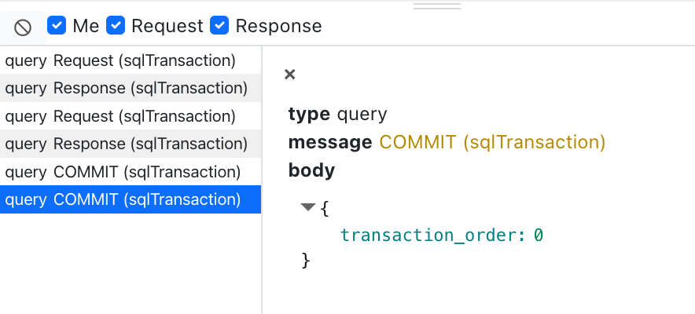

# 편집기 콘솔로그 활용법

쿼리나 API를 개발하고 테스트하는 경우 요청/응답 원본을 그대로 보면 문제를 파악하기 쉽습니다.

셀렉트에서는 모든 요청을 편집기 안에 있는 '콘솔로그’에 표시해주고 있습니다.

디버그용 콘솔로그는 실시간으로 편집중인 사람에게만 전송됩니다. 데이터는 저장되지 않기 때문에 새로고침하면 모두 사라집니다.

- query Request
- query Response
- query Request (sqlTransaction)
- query Response (sqlTransaction)
- query Commit (sqlTransaction)
- http Request
- http Response

> sqlWith를 통한 sqlite in-memory db도 query Request로 표시됩니다.

## 콘솔로그 열기

편집기 오른쪽 위에 있습니다.

## 로그 보기

## 로그 필터링

Cancel(Clear 로그 지우기), Me(나의 로그만 보기), Request(요청 포함여부), Response(응답 포함여부)

이 로그는 어드민 사용자에게 노출 되지 않습니다. 

어드민 관리자/편집 권한이 필요합니다.