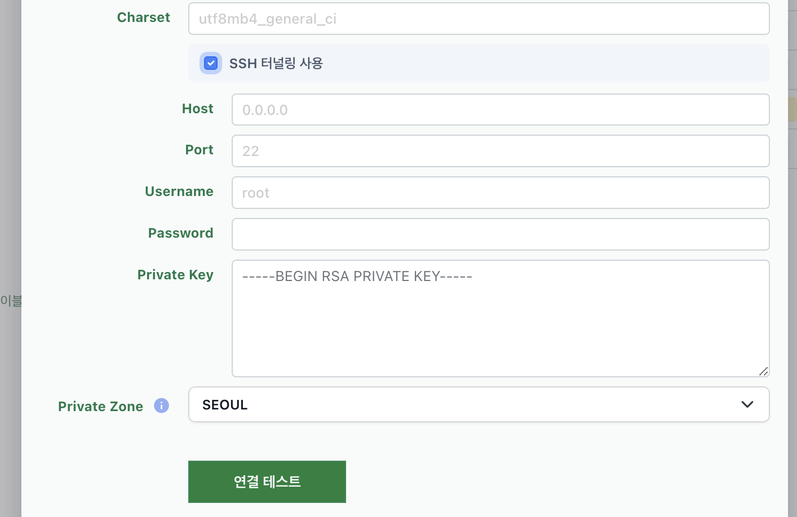
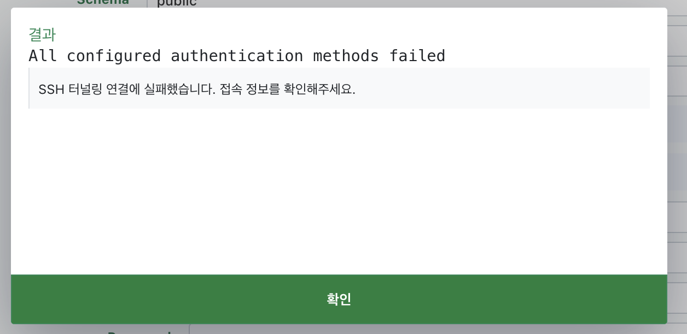

# SSH Tunneling

데이터베이스 연결시 SSH 터널링 방식으로도 진행 가능합니다.

- 허용 리소스: mysql, pgsql, mssql (mongodb, redis등 다른 리소스 허용 필요시 문의바랍니다.)

- 사용법: 정보를 입력하고 연결테스트/저장하면 완료됩니다

- 터널에러 동일하게 표시

- 추후 연결테스트로 테스트가능

- ssh 정보가 바뀐경우 삭제후 다시 추가하시면 됩니다.

- ssh bastion host도 동일하게 아이피 대역을 열어줘야합니다. [데이터베이스 연결 가이드](https://blog.selectfromuser.com/connecting-to-database/)

관련하여 도움이 필요하시다면 support@selectfromuser.com 으로 문의해주세요.