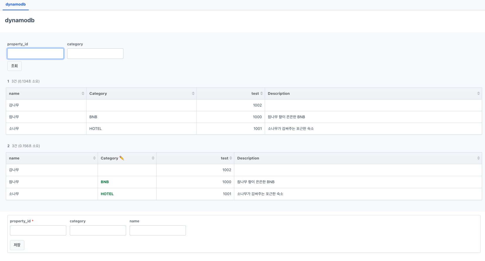

# DynamoDB 사용법

셀렉트어드민에서 DynamoDB를 지원합니다. queryFn을 통해 DynamoDB CRUD 페이지를 빠르게 만들어보세요.



```yaml
menus:
- path: pages/L0Q0s4
  name: dynamodb
pages:
- path: pages/L0Q0s4
  title: dynamodb
  blocks:
  - type: top
    class: border-0 mt-5 p-5 bg-slate-50
    blocks:
    - type: query
      name: 단순조회
      resource: dynamodb
      sqlType: select
      queryFn: |
        if (property_id) {
          const query = {
            TableName: "test",
            KeyConditionExpression: "test = :property_id",
            ExpressionAttributeValues: {
              ":property_id": property_id,
            },
          }
          return await client.send(new QueryCommand(query))
        }
        
        return await client.send(new ScanCommand({
          TableName: "test",
          Limit: 10
        }))

    - type: query
      name: 필터 조회 및 수정
      resource: dynamodb
      sqlType: select
      queryFn: |
        if (property_id) {
          if (category) {
            return await client.send(new ExecuteStatementCommand({
              Statement: "SELECT * FROM test WHERE test = ? AND Category = ?",
              Parameters: [property_id, category],
            }))    
          }
          return await client.send(new ExecuteStatementCommand({
            Statement: "SELECT * FROM test WHERE test = ?",
            Parameters: [property_id],
          }))  
        }

        return await client.send(new ExecuteStatementCommand({
          Statement: "SELECT * FROM test",
          Limit: 10,
        }))
        
      
      params:
        - key: property_id
        - key: category

      columns:
        Category:
          label: Category ✏️
          tdClass: text-green-700 font-bold w-[200px]
          updateOptions:
            type: query
            resource: dynamodb
            sqlType: update
            queryFn: |
              return await client.send(new ExecuteStatementCommand({
                Statement: `
                UPDATE test SET Category = ? WHERE test = ?
                `,
                Parameters: [value || '', test],
              }))
            params:
              - key: test
                valueFromRow: true
                
              
            
  - type: bottom
    class: border-0 mt-3 px-5
    blocks:
    - type: query
      name: 데이터 추가
      resource: dynamodb
      sqlType: insert
      queryFn: |
        return await client.send(new ExecuteStatementCommand({
          Statement: `
          INSERT INTO test VALUE {
            'name': ?,
            'Category': ?,
            'test': ?
          }
          `,
          Parameters: [name || '', category || '', property_id],
        }))
        
      
      params:
        - key: property_id
          required: true
        - key: category
        - key: name
      reloadAfterSubmit: true
```