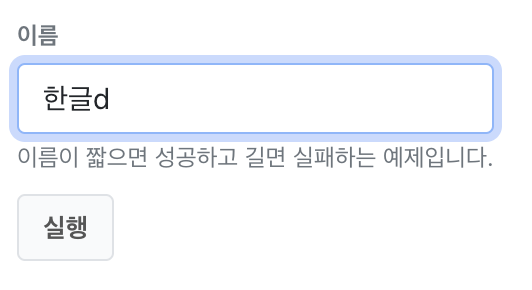
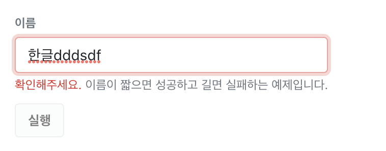
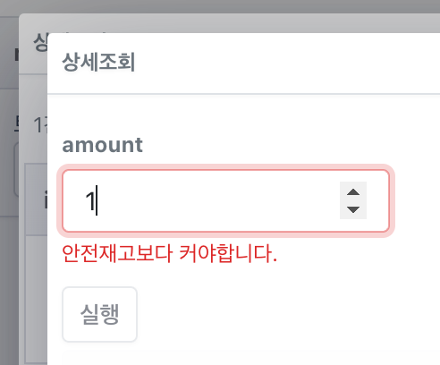

# 입력값 검증하기 Form Validation

## 기본 폼 옵션으로 검증

```yaml
params:
  - key: name
    min: 5
    max: 100
```

## JavaScript 코드로 검증

```yaml
params:
  - key: name
    label: 이름
    help: 이름이 짧으면 성공하고 길면 실패하는 예제입니다.
    validateFn: >
      return String(param.value || '').length < 5
```






## 다른 필드와 함께 검증

다른 필드와 일치하거나, 다른 필드보다 값이 커야하는등 조건을 넣습니다.

```yaml
params:
  - key: amount
    format: number
    validateFn: |
      const safeflow = +params.find(e => e.key == 'safeflow').value
      const amount = +param.value

      if (amount > 0) {
        if (safeflow > amount) {
          return '안전재고보다 커야합니다.'
        }
      }

      return ''
```

