# Self-hosted 로컬 CLI 가이드

셀렉트어드민은 원하시는 경우 고객사의 환경 안에 설치(Self-hosted)하여 이용하실 수 있습니다.

::: info
일부 부가기능은 셀렉트 클라우드에서만 제공됩니다.
:::

설치 방법은 [영상 가이드](https://www.youtube.com/watch?v=9qraoP3xU00)로도 살펴보실 수 있습니다. 

설치형의 특징은 아래와 같습니다.
- 커맨드 라인 인터페이스(CLI)를 통해 바로 이용합니다.  (Vercel과 유사)
- 계정 관리, SSO, 이메일 발송, UI등은 클라우드로 활용합니다.
- 모든 데이터 관련 API는 100% 셀프호스트(로컬) 서버를 이용합니다.
- git, dotenv, editorconfig등 로컬 환경, 편집기를 그대로 이용 가능

이 글에서는 설치형 CLI / Self-hosted 사용법에 대해 안내드립니다.

## 설치

https://www.npmjs.com/package/selectfromuser

`npm i -g selectfromuser@latest` 

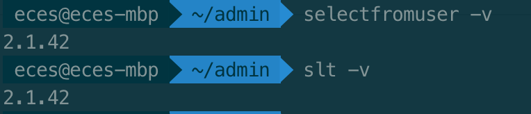

> -v, --version 으로 버전을 확인합니다.

`slt help` 또는 `selectfromuser help` 를 통해 다른 명령어를 확인 가능합니다.

## 로그인

브라우저를 통해 인증을 완료하면 로그인 됩니다.

`slt login`

::: tip
- `cd my-project` 등으로 현재 위치를 원하는 디렉토리로 옮긴 후 로그인하세요
- 프로젝트 로그인 정보는 .select 디렉토리 안에 저장됩니다. .gitignore 등 버전 관리에서 제외해주세요.
:::

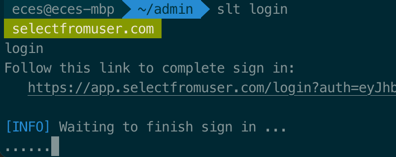

> 브라우저가 열리면 로그인을 합니다.

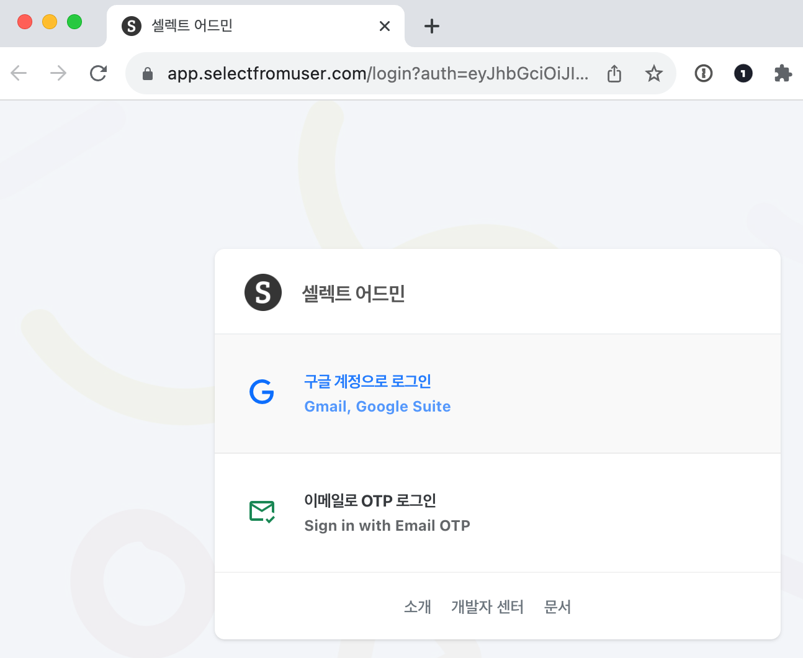

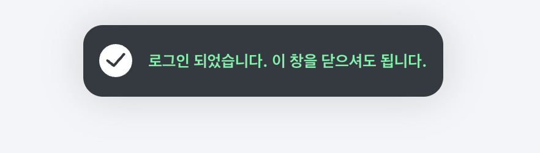

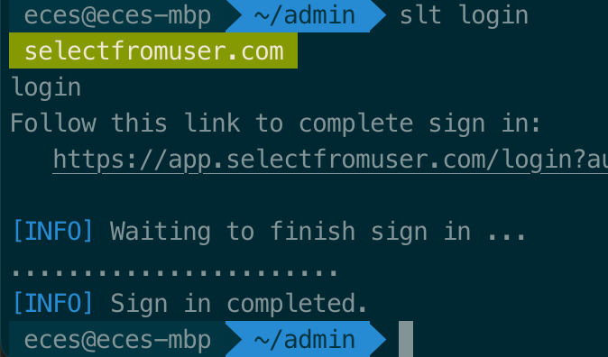

> 로그인 완료. 로그아웃을 하고 싶은 경우 `slt logout`

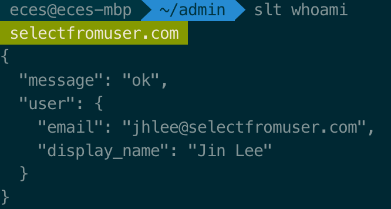 

> 로그인 되어있는 계정을 확인 `slt whoami`


## 프로젝트 만들기

`slt` 또는 `slt dev` 로 서버를 실행합니다.

- 기존 팀(프로젝트)를 연결하거나 새로 만듭니다. (엔터를 눌러서 새로 만들기)
- 팀(프로젝트) 이름을 입력합니다. 나중에 변경 가능 (엔터를 눌러서 다음으로)

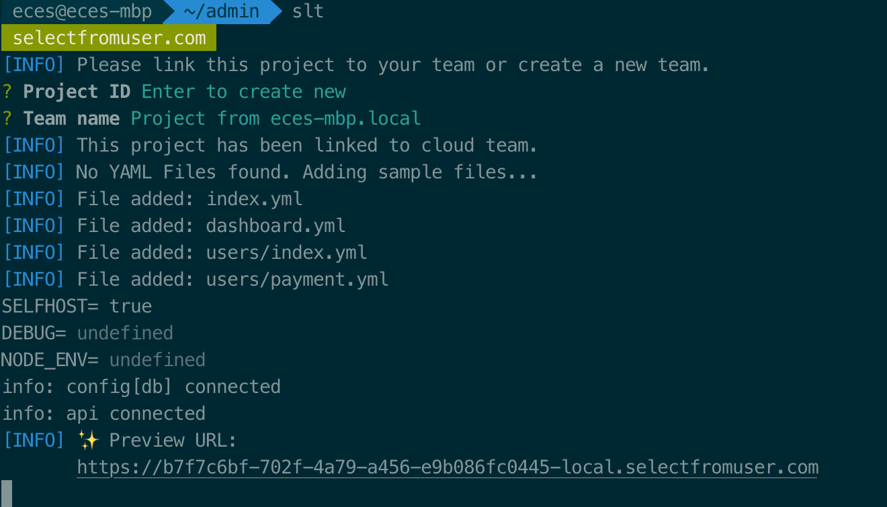 

> Preview URL이 표시됩니다.

표시된 Preview URL로 접속합니다.

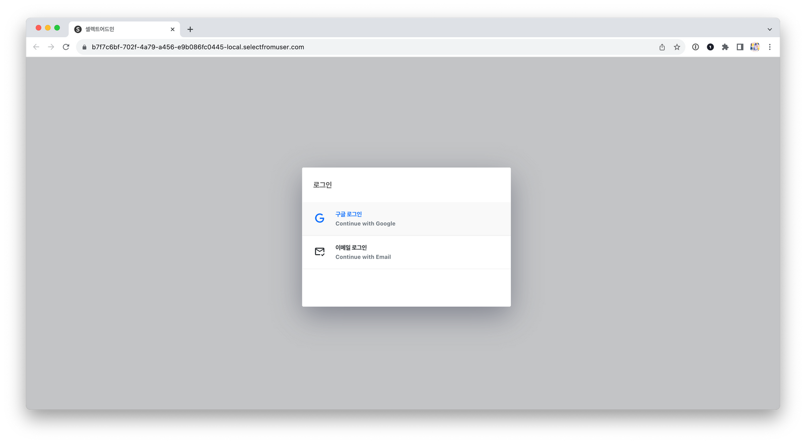

> 구글 또는 이메일 OTP 인증

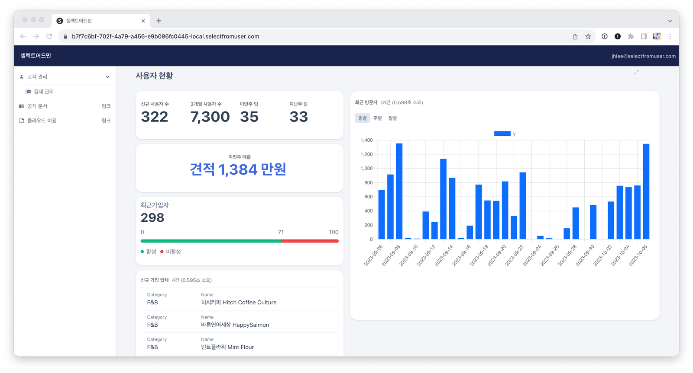

> 샘플로 추가된 화면 (dashboard.yml)

## 데이터 연결하기

샘플로 추가된 `index.yml` 파일에 리소스 연결을 추가합니다.

> 샘플이 생기지 않았다면 `slt init` 으로 다시 추가 가능합니다.

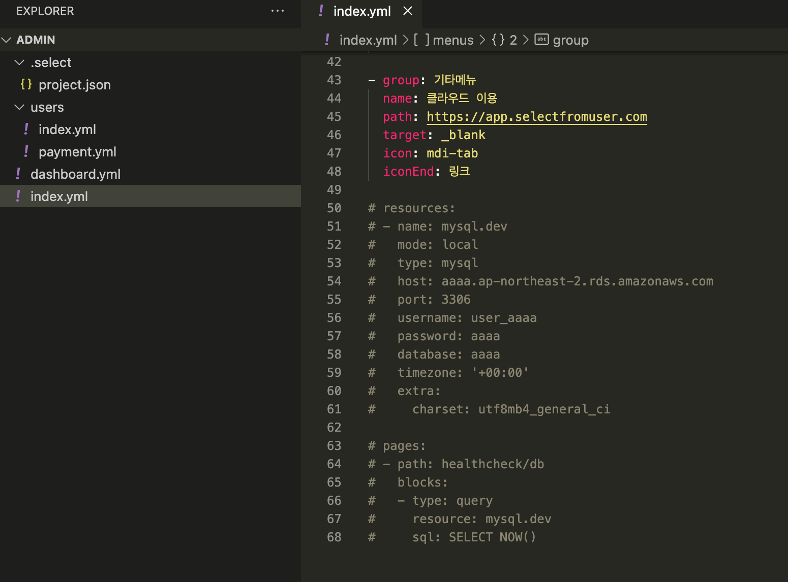

계정 정보는 직접 입력하거나 환경변수에서 가져옵니다. (`$`로 시작)

```yaml
resources:
- name: mysql.dev
  type: mysql
  host: $DB_HOST
  port: $DB_PORT
  username: $DB_USERNAME
  password: $DB_PASSWORD
  database: ysg
  timezone: '+00:00'
  extra:
    charset: utf8mb4_general_ci

---
# 데이터베이스 잘 연결되었는지 확인하는 페이지

menus:
- path: healthcheck/db
  placement: page-only

pages:
- path: healthcheck/db
  title: 데이터베이스 연결을 확인합니다.
  blocks:
  - type: query
    resource: mysql.dev
    sql: SELECT * FROM test_image
```

> index.yml 수정

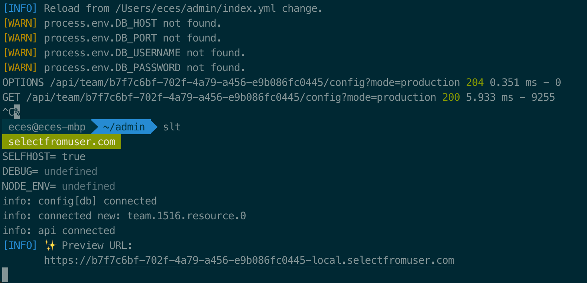

> 환경변수 반영을 위해 재시작합니다. `connected new` 로 표시됩니다.

- YAML 파일을 저장하면 watch-reload 됩니다. (자동 새로고침)
- 디렉토리를 자유롭게 구성하여도 됩니다.


## 초대하기

[셀렉트 클라우드](https://app.selectfromuser.com/)에 접속하여 팀 설정 페이지를 통해 초대합니다.

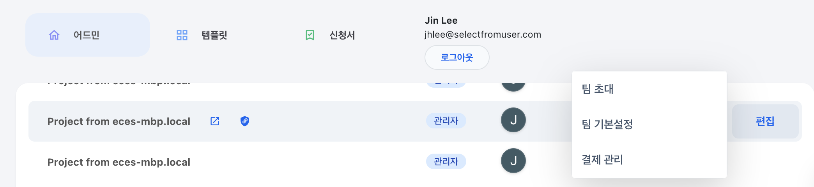

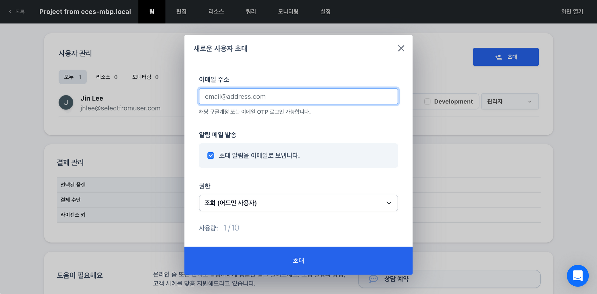

여러명이 사용하려고 할때는 서버에 별도로 배포가 필요합니다.

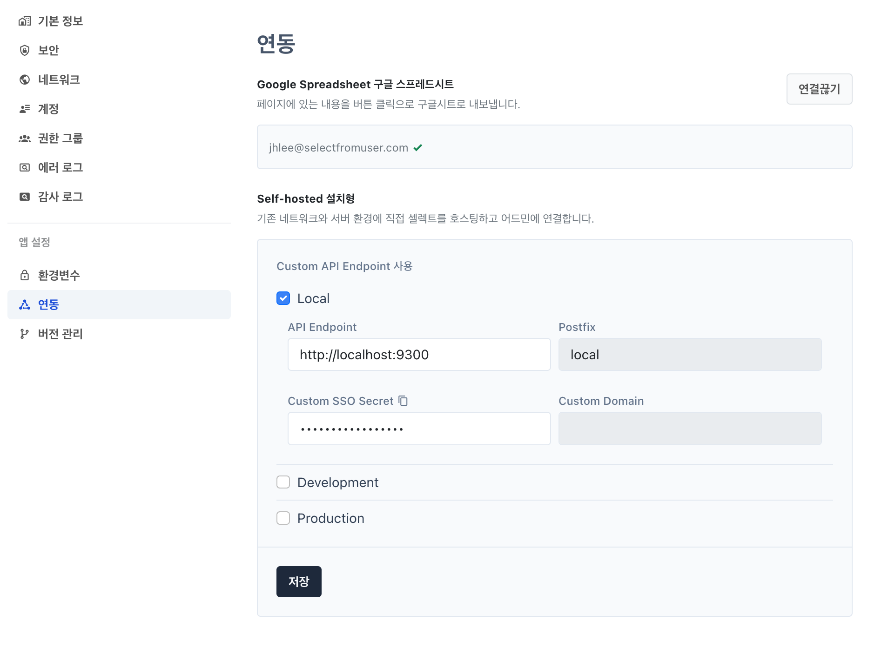

> 각 환경에 배포된 API Endpoint를 설정합니다. *설정에 따라 아래와 같이 접속주소가 구성됩니다. 
> - LOCAL `subdomain-local.selectfromuser.com`
> - DEV `subdomain-dev.selectfromuser.com` 
> - PROD `subdomain.selectfromuser.com` (커스텀 도메인을 희망하는 경우 문의바랍니다.)

### 관련 자료

- https://blog.selectfromuser.com/select-admin-cli/