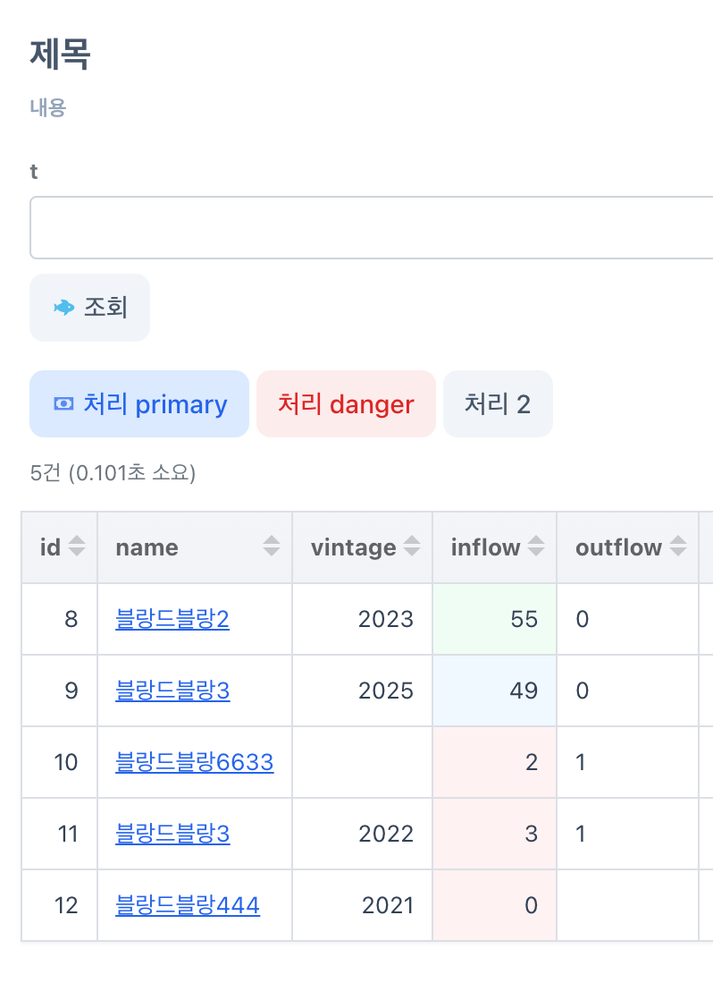

# 스타일, 디자인 가이드

어드민 화면을 꾸미거나 버튼의 시각적인 요소를 변경합니다.

### 기본 스타일

셀렉트 어드민은 명확하고 일상 사용에 필요한 UI 디자인을 기본으로 적용하였습니다.

- 과도한 그림자 제거
- 마우스 올리면 표시
- 최소 크기 이상의 버튼
- 일관된 확인/취소 버튼
- 동작 범위에 있는 버튼만 표시
- 액션버튼의 위치 고정
- 입력칸 위치 고정

## 입력폼 `params` 꾸미기

> 스타일 방법을 추가 중 입니다.

Inline CSS 입력하기

```yml
params:
- key: name
  style: |
    width: 300px;
```

CSS Object 입력하기

```yml
params:
- key: name
  style:
    width: 300px
```

Class 입력하기

tailwindcss 이용 가능합니다.

```yml
params:
- key: name
  class: w-1/3 p-3 bg-amber-100 rounded-lg shadow-md
```

## 컬럼 `columns` 꾸미기

> 스타일 방법을 추가 중 입니다.

테이블 꾸미기

- `tdClass` String: table cell
- `thClass` String: table header
- `tdClass` Function: table cell conditional style

```yml
columns:
  inflow:
    # tdClass: bg-slate-50
    tdClass: |
      if (+row.inflow > 50) return 'bg-green-50'
      if (+row.inflow > 40) return 'bg-sky-50'
      return 'bg-red-50'
```


## 페이지 레이아웃 꾸미기

기본 화면에서 결과물 화면을 더 구분해야하는 경우 페이지 단위로 `styleGuide`를 입력하여 스타일을 통일합니다.


```yml
menus:
- path: pages/l14g9x
  name: 새로운 메뉴
pages:
- path: pages/l14g9x
  title: 제목
  subtitle: 내용

  styleGuide:
    page: bg-slate-50
    blocks: bg-white border rounded py-2
    params: border-t border-b
    results: border m-2 p-2 rounded
    
  blocks:
  - type: query
    resource: mysql.qa
    sqlType: select
    sql: SELECT * FROM wine_stock
```

- page: 페이지 전체 스타일
- blocks: 블록 단위 스타일
- params: 입력폼 단위 스타일
- results: 결과물 단위 스타일
- pageParams: 페이지 입력폼 단위 스타일 (기본값: `m-2 mb-4 p-3 border border-slate-300 rounded-lg bg-slate-50 drop-shadow-sm `)


  
## 버튼 스타일 꾸미기

글로벌 단위로 `styleGuide`를 입력하여 스타일을 통일합니다.

- actions, form, submit, reset, ok, discard 버튼에 적용됩니다.
- `button.type`, `submitButton.type`에 해당하는 값을 검색하여 반영합니다.
- 설정된 스타일이 없는 경우 기본 버튼 스타일이 적용됩니다. `disabled:opacity-50 disabled:cursor-default no-underline cursor-pointer rounded bg-white text-[13px] px-2.5 py-1.5 font-semibold text-gray-900 shadow-sm ring-1 ring-inset ring-gray-300 enabled:hover:bg-gray-50 `

```yml
layout:
  styleGuide:
    button: bg-slate-100 text-slate-600 px-3 py-2 font-medium rounded-lg hover:bg-slate-200
    buttonPrimary: bg-blue-100 text-blue-600 px-3 py-2 font-medium rounded-lg hover:bg-blue-200 cursor-pointer
    buttonDanger: bg-red-500/10 text-red-600 px-3 py-2 font-medium rounded-lg hover:bg-red-100 cursor-pointer
```



