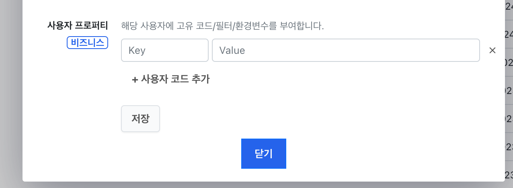
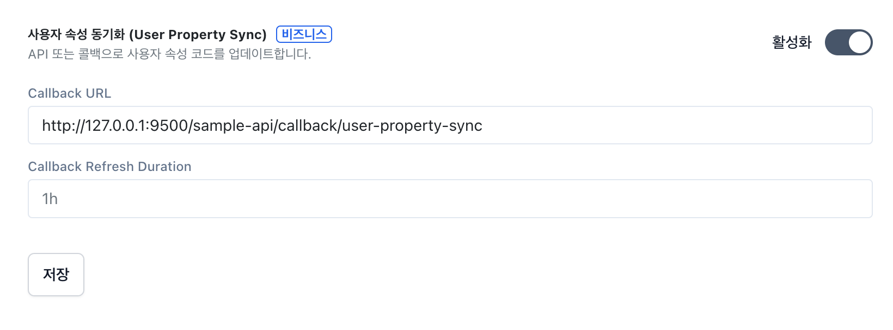
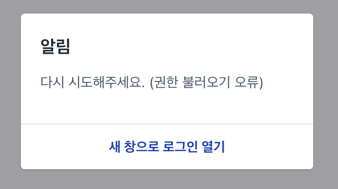
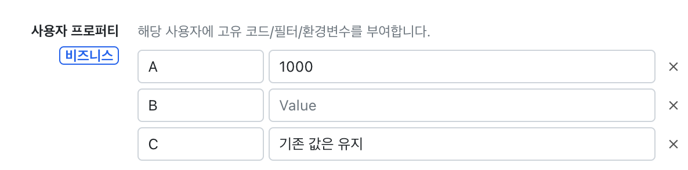

# 사용자 속성 (UserProperty) 동기화 사용법

## 사용자 속성에 대한 이해

셀렉트 어드민에서는 사용자 속성 (UserProperty) 기능으로 접속자 마다 특별 처리 기능을 제공합니다.

- 소속에 해당하는 자료만 조회
- 자료 추가시 부여된 코드를 입력
- 나의 상점 데이터만 표시

관리자 계정은 `설정 > 계정` 화면에서 계정마다 사용자 속성을 입력 가능합니다.



## 외부 서비스, 권한과 연계하는 경우

자체 앱이나 서비스에서 별도 부여한 권한(상점관리자)에 따라 사용자 속성을 지정하고자 하는 경우 연동이 필요합니다.

## 1. Callback 콜백 방식으로 연동

- 사용자 로그인시 설정한 URL로 권한 조회를 요청합니다.
- 응답한 권한에 따라 사용자속성을 업데이트합니다.
- 최신 업데이트된 권한으로 로그인이 완료됩니다.



> `설정 > 계정 > 사용자 속성 동기화` 메뉴에서 활성화 합니다.

개발, 테스트 시에는 10s 짧게 설정하여 즉시 다시 인증하도록 권장합니다.

### 1-1. 인증토큰 발급하기

`설정 > 환경변수` 에서 `SELECT_USER_CALLBACK_TOKEN` 이름으로 추가한 키값을 인증키로 사용합니다. 유추하기 어려운 고유값(UUID등)으로 지정해주세요.

### 1-2. API 준비하기

Callback URL에 대한 Request 내용은 다음과 같습니다.

- Method: `POST`
- Header: `Authorization: 인증토큰`
- JSON Body:
    - domain: 어드민 도메인 또는 팀 아이디
    - mode: 프로덕션 또는 환경이름
    - id: 셀렉트 사용자 아이디
    - email: 로그인 사용자 이메일

위의 정보로 사용자를 식별하고 알맞는 권한을 Response 내용에 추가합니다.

- JSON Body
    - message: 성공시 `ok` , 비활성화시 skip, 실패시 `에러메시지`
    - user_property_json: 사용자에게 부여할 사용자 속성목록

> 동일한 키는 값이 업데이트되고, 새로운 키는 추가, 기존의 설정된 키는 유지 (삭제하고싶으면 빈칸으로 업데이트)

```
// 해당 사용자에게 업데이트
res.status(200).json({
  message: 'ok',
  user_property_json: [
    {
      key: 'A',
      value: '1000',
    },
    {
      key: 'B',
      value: '', // 이 경우 해당 프로퍼티는 빈값
    },
  ]
})

// 해당 사용자는 통과
res.status(200).json({
  message: 'skip',
})

// 해당 사용자는 통과
res.status(200).json({
  message: '디버깅용 식별가능한 내부 에러메시지 (셀렉트 에러로그에 보관)',
})
```
> user_property_json 의 3가지 예제 

따라서 위의 전체 흐름을 구현한 Callback URL API 예시는 아래와 같습니다.

**Node.js 예제**

```
router.post('/callback/user-property-sync', async (req, res, next) => {
  try {
    const auth = req.get('authorization')
    if (auth != 'PRIVATE_API_TOKEN') throw new StatusError(403)

    const domain = req.body.domain
    const id = req.body.id
    const email = req.body.email

    if (email == "test@selectfromuser.com" && domain == 47) {
      res.status(200).json({
        message: 'ok',
        user_property_json: [
          {
            key: 'A',
            value: '1000',
          },
          {
            key: 'B',
            value: '',
          },
        ]
      })
      return
    }
    res.status(200).json({
      message: 'unknown user',
    })
  } catch (error) {
    next(error)
  }
})
```

**Java(Spring) 예제** 

```
@RestController
@RequestMapping("/callback")
public class UserPropertySyncController {

    private static final String PRIVATE_API_TOKEN = "PRIVATE_API_TOKEN";

    @PostMapping("/user-property-sync")
    public ResponseEntity<UserPropertySyncResponse> userPropertySync(
            @RequestHeader(value = "Authorization", required = false) String authorization,
            @RequestBody UserPropertySyncRequest request) {

        // 인증 토큰 검증
        if (authorization == null || !authorization.equals(PRIVATE_API_TOKEN)) {
            throw new ForbiddenException("Forbidden");
        }

        String email = request.getEmail();
        String domainStr = request.getDomain();
        int domain;
        try {
            domain = Integer.parseInt(domainStr);
        } catch (NumberFormatException e) {
            throw new ResponseStatusException(HttpStatus.BAD_REQUEST, "Invalid domain format");
        }

        if ("test@selectfromuser.com".equals(email) && domain == 47) {
            UserProperty propA = new UserProperty("A", "1000");
            UserProperty propB = new UserProperty("B", "");
            UserPropertySyncResponse response = new UserPropertySyncResponse(
                    "ok",
                    Arrays.asList(propA, propB)
            );
            return ResponseEntity.ok(response);
        }

        UserPropertySyncResponse unknownResponse = new UserPropertySyncResponse("unknown user");
        return ResponseEntity.ok(unknownResponse);
    }

    // 전역 예외 처리 (선택 사항)
    @ExceptionHandler(ForbiddenException.class)
    public ResponseEntity<String> handleForbiddenException(ForbiddenException ex) {
        return ResponseEntity.status(HttpStatus.FORBIDDEN).body(ex.getMessage());
    }

    @ExceptionHandler(ResponseStatusException.class)
    public ResponseEntity<String> handleBadRequestException(ResponseStatusException ex) {
        return ResponseEntity.status(ex.getStatus()).body(ex.getReason());
    }

    // 기타 예외 처리 (선택 사항)
    @ExceptionHandler(Exception.class)
    public ResponseEntity<String> handleGeneralException(Exception ex) {
        return ResponseEntity.status(HttpStatus.INTERNAL_SERVER_ERROR)
                .body("Internal server error");
    }
}
```

### 1-3 Callback API 테스트하기

어드민 접속시 인증이 자동으로 이루어지고 사용자 속성이 잘 반영되는지 확인합니다.



> API 응답 에러가 있는 경우 사용자에게 표시됩니다.



> A, B에 대한 수정이 이루어졌습니다.

### 참고

- 감사로그에는 변경 before/after 기록이 남고, modified by callback 표기
- Callback Refresh Duration
    - 기본값 1시간 (ex: 최초 인증성공후 1시간동안 권한유지)
    - 짧게 하면 빈번하게 요청하여 실패할수도있으나 정확함 (필요에 따라 설정)
- 관리자(admin)은 해당 콜백 실패해도 로그인 바로 진행됨 (로그남음)
- 사용자(view,edit)는 실패시 `다시 시도해주세요. (권한 불러오기 오류)` 표시후 접속 실패

## API 방식으로 연동

준비중 입니다. 관련 도움이 필요하시다면 support@selectfromuser.com 으로 문의해주세요.