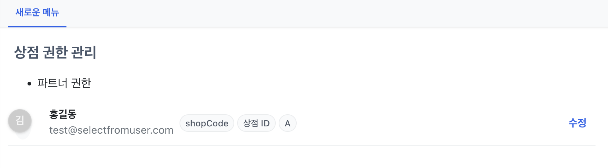
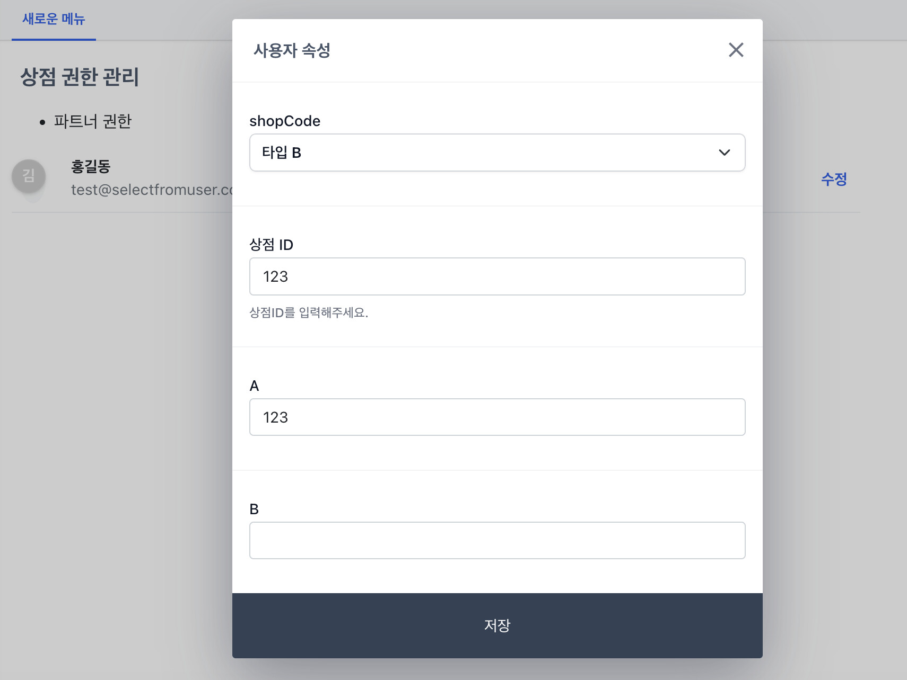

# 사용자 속성 수정 블록

셀렉트어드민 일반 사용자(view 권한)가 사용자 속성(user property) 값을 입력할 수 있는 블록(blocks.type)을 제공합니다.

```yaml
blocks:
  - type: userProperty
``` 

해당 기능을 이용하면 관리자(admin) 권한이 없어도 규정된 환경에서 사용자 속성(user property)을 입력할 수 있습니다.

설정 > 계정 페이지에 접속하지 않고, 일반 어드민 화면에서 입력이 필요한 경우 이용해보세요.





## 예제 YAML 및 유의사항

- 꼭 `type: userProperty`와 동위에 `roles edit`을 입력하셔야합니다. (roles가 없는경우 에러를 띄워줍니다.)
- [blocks.roles](/reference#blocks-roles)는 설정 > 권한 그룹에서 추가할 수 있습니다.
- 사용자는 properties 키에 설정된 필드와 값들만 입력할 수 있습니다.

```yaml
menus:
- path: pages/LiyQhD
  name: 새로운 메뉴
pages:
- path: pages/LiyQhD
  containerStyle: |
    width: 800px
  # class: container
  title: 상점 권한 관리
  blocks:

  - type: markdown
    content: |
      - 파트너 권한
  
  - type: userProperty

    roles:
      edit: 
        - 계정관리
    
    properties:
      shopCode:
        type: string
        placeholder: 상점코드
        dropdown:
          # - A
          # - B
          A: 타입 A
          B: 타입 B
      shopId:
        type: string
        label: 상점 ID
        placeholder: 상점ID 8자리
        description: 상점ID를 입력해주세요.
      A:
        type: string
      B:
        type: string
        # required: true
```

해당 기능은 특정 플랜 이상에서 이용 가능합니다.

관련하여 도움이 필요하시거나 제안하고 싶으신 기능이 있다면 문의주시기 바랍니다.