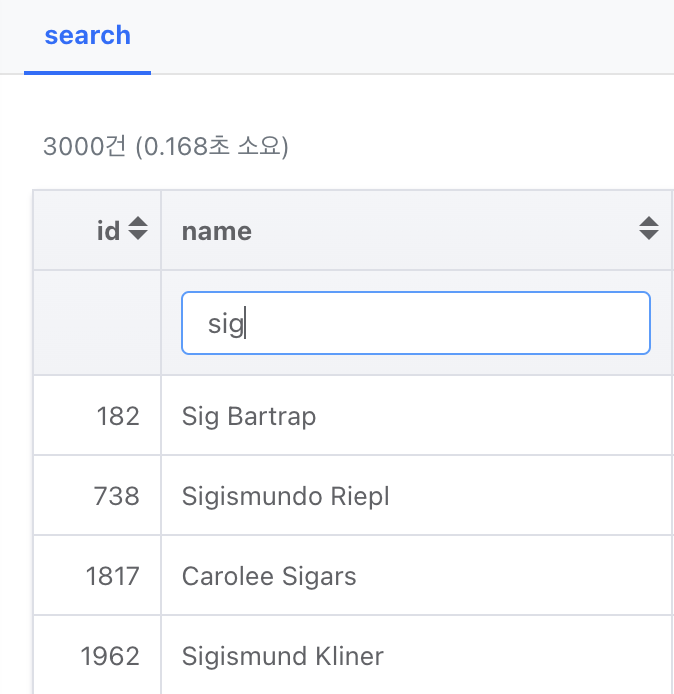

# 간편 검색

## 테이블 간편 검색

테이블 데이터를 클라이언트 단에서 빠르게 검색하는 기능을 추가할 수 있습니다. 대량의 데이터를 개별 필드로 필터링해서 보고싶으신 경우 params를 활용해주세요.


```yaml
blocks:
- type: query
  ...
  searchOptions:
    enabled: true
```

## 컬럼 간편 검색

전체 테이블을 한번에 검색하지 않고, 컬럼 단위로 찾아볼 수 있게 검색창을 추가할 수 있습니다.



```yaml
sql: SELECT * FROM test_10k
columns:
  name:
    filterOptions:
      enabled: true
      placeholder: 이름 검색
```